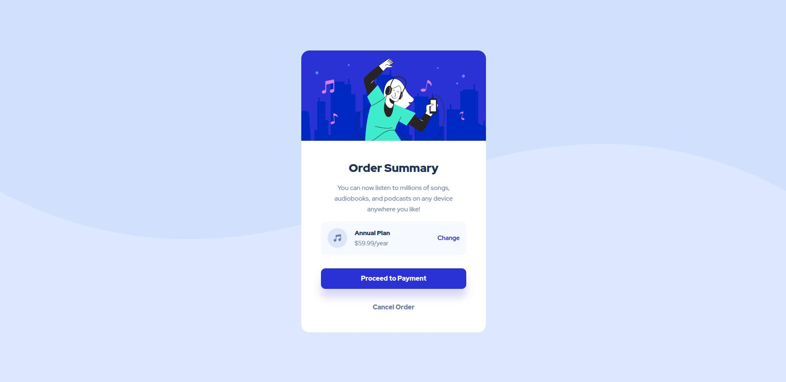

# Frontend Mentor - Order summary card solution

This is a solution to the [Order summary card challenge on Frontend Mentor](https://www.frontendmentor.io/challenges/order-summary-component-QlPmajDUj). Frontend Mentor challenges help you improve your coding skills by building realistic projects. 

## Overview

### Screenshot

## My process
### Built with
... Vite and some basic html5/css skills

### What I learned
- Styled buttons manually for the first time instead of using a CSS library
- Experimented with background and background-image properties

## Author

- Website - [Resume](https://piotrniezgoda.pl/)
- Frontend Mentor - [@niezgoda-piotr](https://www.frontendmentor.io/profile/niezgoda-piotr)

## Acknowledgments
Thanks [frontendmentor.io](https://www.frontendmentor.io/)
So I can focus on implementation rather than idea generation.
